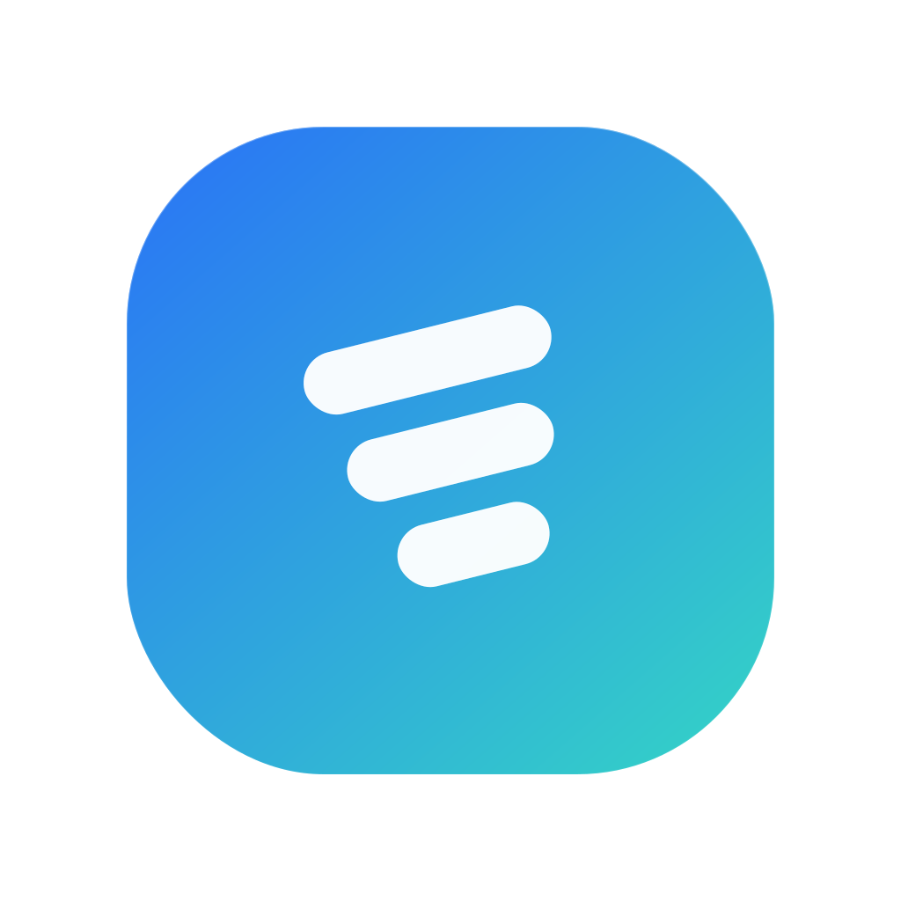
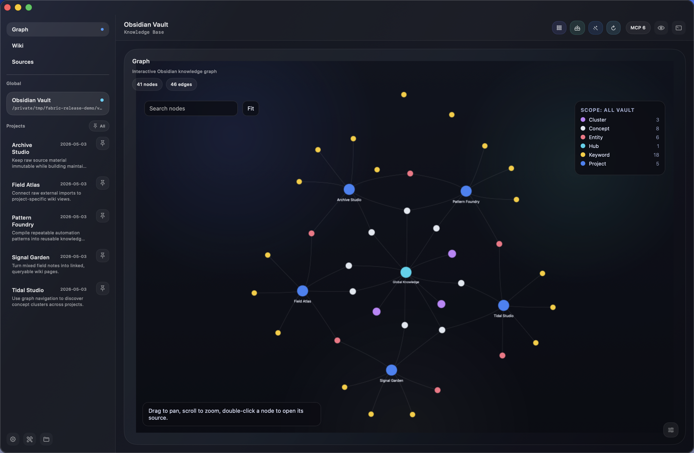
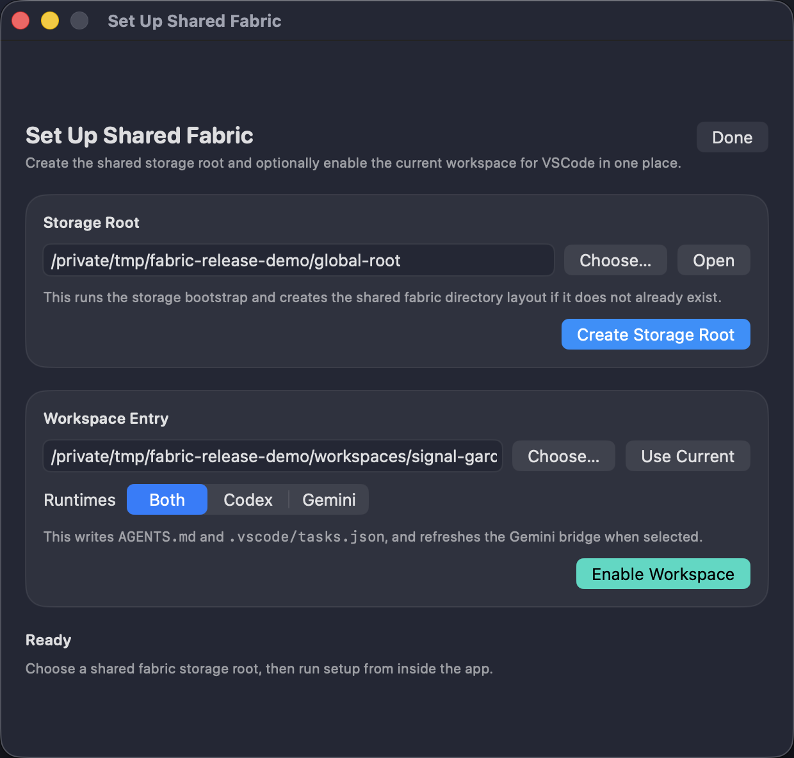
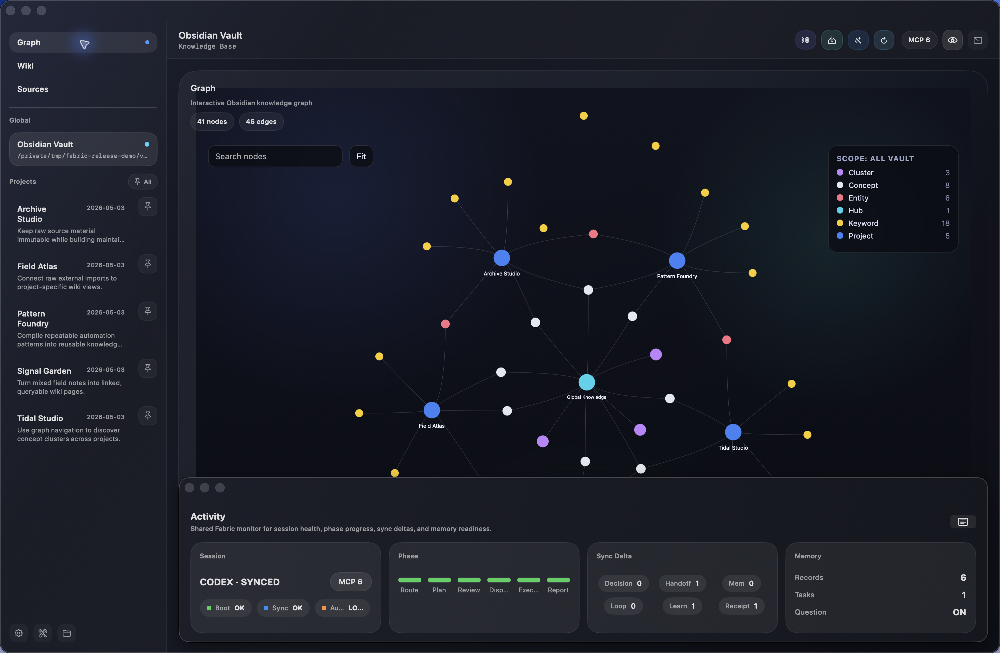
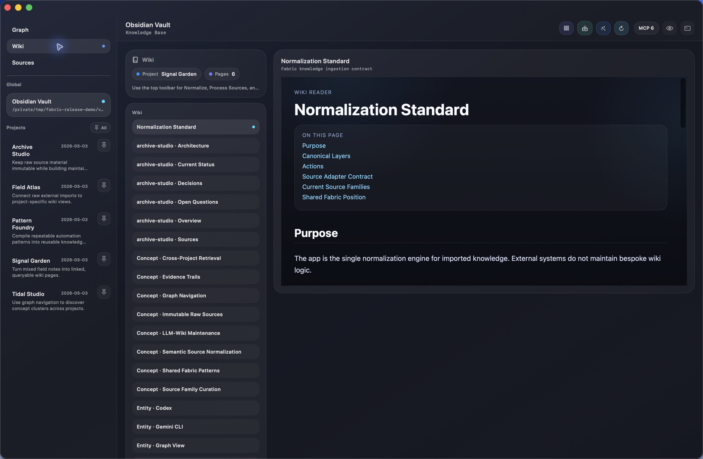
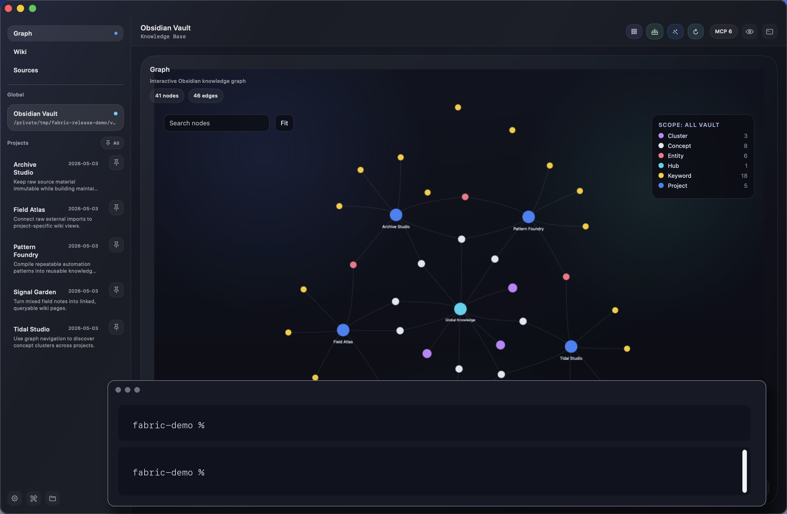

# Fabric

<p align="center">
  
</p>

<h3 align="center">An LLM-Native Knowledge Base Maintainer for Shared Fabric and Obsidian</h3>

<p align="center">
  Fabric turns high-volume AI output into a maintained wiki, a semantic graph, and a queryable terminal workflow.
  <br/>
  It is inspired by the <strong>llm-wiki</strong> pattern: raw sources stay raw, while the wiki becomes the durable synthesis layer.
</p>

<p align="center">
  
  
  
  
  
</p>

<p align="center">
  <a href="https://github.com/Fly-Carrot/Fabric/releases/tag/v4.0.0">Download Fabric v4.0.0</a>
  ·
  <a href="docs/releases/v4.0.0.md">Release Notes</a>
  ·
  <a href="tools/compact_dashboard_desktop/">Desktop App Source</a>
</p>



## Why Fabric Exists

Most agent workflows still stop at one of two weak endpoints:

- raw conversations are archived, but not maintained into durable knowledge
- wiki pages exist, but the source-to-wiki pipeline is informal and hard to inspect

Fabric closes that gap. Its purpose is **not** to collect more data for its own sake; it is to turn messy AI-era work products into a **living LLM-wiki** that humans and agents can both read, search, visualize, and improve.

It keeps **Agent Shared Fabric** as the canonical cross-agent governance and memory layer, while turning **Obsidian** into a maintained knowledge base with a clear operating model:

- raw sources remain immutable
- sources are normalized before synthesis
- wiki pages become the maintained human-readable layer
- graph nodes become the semantic navigation layer
- terminal + agents become the query and maintenance layer

The split is intentional: **Agent Shared Fabric governs agent discipline and memory**, while **Fabric App consumes the resulting receipts, sources, wiki pages, graph data, and indexes** as a knowledge workstation.

## The Fabric Architecture

Fabric is not just the macOS app. It is a local operating architecture for keeping agents, tools, sources, wiki pages, and graph/query workflows aligned.

At the system level, the complete Fabric architecture has four layers:

- **Governance brain**: `global-agent-fabric` stores rules, memory routing, project registries, MCP registries, workflow registries, and sync scripts.
- **Implementation body**: external skill, workflow, MCP, and subagent implementations live outside the governance root so the control plane stays small and portable.
- **Knowledge base**: Obsidian holds raw sources, maintained wiki pages, semantic indexes, manifests, and graph data.
- **Workbench**: `Fabric.app` makes setup, monitoring, wiki, source processing, graph navigation, and terminal-based maintenance visible in one place. It consumes artifacts; it is not the governance source of truth.

The architecture is deliberately inspired by several proven patterns, without claiming endorsement or affiliation:

- **Obsidian** for human-readable, durable wiki pages.
- **llm-wiki-style knowledge maintenance** where raw sources remain raw and the wiki becomes the synthesis layer.
- **三省六部-style workflow discipline** for staged routing, planning, review, dispatch, execution, and reporting.
- **edict-style rule/workflow repositories** for durable instructions that agents can repeatedly load.
- **MemPalace-style memory routing** for separating reusable learnings from detailed process traces.
- **Maestro-style orchestration** for explicit subagent delegation when a task is complex enough to justify it.
- **Skill and MCP registries** for tool discovery without copying every implementation into every runtime.

See [Fabric Architecture](docs/fabric-architecture.md) for the full model.
See [MCP Integration Guide](docs/mcp-integration-guide.md) before enabling third-party tool servers.

## Product Flow

### 1. Shared Fabric Setup



Use the setup assistant to establish the shared fabric root, workspace bridge files, and canonical sync workflow that Codex and Gemini CLI both follow.

### 2. Fabric Monitor



Watch session health, phases, sync deltas, memory signals, and recent activity in a compact observer that keeps the runtime honest without becoming the product itself.

### 3. Obsidian Wiki Foundation



Treat Obsidian as a maintained wiki layer rather than an export sink. Fabric helps normalize the vault structure, compile project pages, and keep the knowledge base legible.

### 4. Sources + Deep Extraction


External tools can stage raw inputs such as NotebookLM notes, agent chats, and shared-fabric snapshots. Fabric then normalizes, clusters, and compiles those materials into project-aware and vault-wide knowledge. Acquisition utilities live outside the core app so the public product stays focused on processing, synthesis, and retrieval.

### 5. Graph + Terminal



Navigate the semantic graph for exploration, then move directly into the embedded terminal for retrieval, maintenance, and agent-assisted knowledge work.

## What You Actually Get

- **Shared Fabric setup + monitoring** for Codex and Gemini CLI
- **Obsidian wiki foundation tools** for normalize/process/build flows
- **Source normalization prompts** for turning raw imports into clean source families
- **Build-all prompts** for compiling wiki pages, semantic artifacts, and graph data
- **Semantic graph exploration** with project, concept, entity, keyword, and cluster views
- **Terminal workflow** for local reasoning, querying, and structured maintenance

## LLM-Wiki Positioning

Fabric is **inspired by the llm-wiki pattern**, not affiliated with or endorsed by any specific author or project.

The practical interpretation used here is:

- `00 Raw Sources` stays append-only
- `10 Wiki` becomes the maintained synthesis layer
- `90 System` records schemas, manifests, graphs, indexes, and logs
- Shared Fabric stays outside the vault as the canonical operational memory system

That makes Fabric a better fit for long-running personal and project knowledge than using exported chat history as the final artifact.

## Quick Start

### 1. Create the shared storage root

```bash
python3 install/bootstrap_shared_fabric.py
```

### 2. Enable a workspace

```bash
python3 install/bootstrap_vscode_workspace.py \
  --workspace /path/to/workspace \
  --global-root /path/to/global-agent-fabric \
  --runtimes both
```

### 3. Build the desktop app

```bash
./tools/compact_dashboard_desktop/build_dashboard_app.sh
```

This produces `Fabric.app`.

### 4. Package the public release artifact

```bash
./scripts/package_fabric_release.sh
```

This produces:

- `dist/Fabric-v4.0.0-macOS.zip`
- `dist/Fabric-v4.0.0-macOS.zip.sha256.txt`

## Recommended Runtime Contract

Use a workspace-adjusted form of this in your runtime instructions:

```text
Use /path/to/global-agent-fabric as the canonical shared fabric.
Before substantial work, run the shared boot sequence for this workspace and report [BOOT_OK].
Load global shared context first, then runtime-specific context, then the current project overlay.
For complex tasks, emit exact six-stage phase events via log_task_phase.py.
Write back through postflight_sync.py and report [SYNC_OK].
Treat this workspace as project-scoped, not global.

Do not write directly to memory/*.ndjson or sync/*.ndjson; use canonical sync scripts only.
Prefer canonical rich-memory bundle generation over ad-hoc summary-only records.
Route stable reusable learnings to promoted learning, and route detailed process memory / trial-and-error to MemPalace.

Maintain a distilled user-question profile through canonical postflight sync.
Use available MCP tools and local skills when they materially improve accuracy, but keep shared-fabric synchronization on canonical scripts rather than ad-hoc file writes.
```

## Repository Layout

```text
Fabric/
  docs/
    assets/
    releases/
  fabric/
    scripts/
      sync/
  install/
  scripts/
  tests/
  tools/
    acquisition/                 # optional personal import helpers
    compact_dashboard/
    compact_dashboard_desktop/
```

## Notes

- The public desktop bundle is now named `Fabric.app`.
- Raw acquisition is intentionally treated as an external input layer; Fabric focuses on normalization, compilation, graphing, and query-time knowledge work.
- MCP servers are disabled by default in the public starter. Enable only trusted tools in your private runtime registry.
- Runtime logs remain available inside the app, but they are support tooling rather than the product center.
