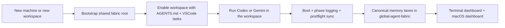

# Shared Fabric Dashboard

Shared Fabric Dashboard is a setup-first control plane for running Codex and Gemini against one canonical shared fabric.

It gives you a clean way to bootstrap a reusable storage root, inject workspace rules into VSCode, and observe sync, task phases, and project memory from a terminal dashboard or a native macOS app.

[Download v3.0.0](https://github.com/Fly-Carrot/antigravity-codex-deployment/releases/tag/v3.0.0) · [Release Notes](docs/releases/v3.0.0.md) · [Desktop App Source](tools/compact_dashboard_desktop/)


## What You Get

| Capability | What it does | Main entrypoint |
| --- | --- | --- |
| Storage bootstrap | Creates a new canonical shared-fabric root on a new machine | `python3 install/bootstrap_shared_fabric.py` |
| Workspace enablement | Injects `AGENTS.md` plus VSCode tasks into any project workspace | `python3 install/bootstrap_vscode_workspace.py` |
| Exact task tracking | Mirrors `route -> plan -> review -> dispatch -> execute -> report` across the dashboards | `fabric/scripts/sync/log_task_phase.py` |
| Rich memory lanes | Expands sync writes into `Decision`, `Handoff`, `Mem`, `Loop`, `Learn`, and `Receipt` records | `fabric/scripts/sync/postflight_sync.py` |
| macOS dashboard | Workspace switcher, settings, sync drill-down, project memory browser, setup assistant | `tools/compact_dashboard_desktop/` |

## Why This Repo Exists

This repository is not your live memory store.

It is the portable deployment snapshot for standing up the same shared-fabric system on another machine without copying private local state. The canonical runtime state still lives in the shared fabric root you choose during bootstrap.

## Product Shape



## Setup In Two Steps

### 1. Create the shared storage root

```bash
python3 install/bootstrap_shared_fabric.py
```

For non-interactive setup:

```bash
python3 install/bootstrap_shared_fabric.py \
  --non-interactive \
  --global-root /path/to/global-agent-fabric \
  --desktop-root /path/to/Desktop
```

This step creates the shared directory skeleton, renders local config, installs the framework snapshot, and runs the doctor chain.

### 2. Enable a workspace

```bash
python3 install/bootstrap_vscode_workspace.py \
  --workspace /path/to/workspace \
  --global-root /path/to/global-agent-fabric \
  --runtimes both
```

This step generates:

- project-root `AGENTS.md`
- `.vscode/tasks.json`
- Gemini compatibility settings when Gemini is enabled

The generated VSCode task surface includes:

- `Shared Fabric: Boot Current Workspace`
- `Shared Fabric: Sync Current Workspace`
- `Shared Fabric: Postflight Sync`
- `Shared Fabric: Open Global Root`
- `Shared Fabric: Rebuild Workspace Entry`

## What The Desktop App Adds

The macOS app is designed as a lightweight operator surface instead of a second source of truth.

- Auto-follow or pin a workspace
- Inspect the latest sync delta without opening lane files manually
- Browse cumulative project memory across all six lanes
- Open setup actions from the app when provisioning a new machine or workspace
- Track the exact six-stage workflow in real time

## Shared Memory Model

The shared fabric keeps one canonical memory family and expands task outputs into six visible boards:

| Board | Purpose |
| --- | --- |
| `Decision` | Chosen approaches, architecture calls, user-approved directions |
| `Handoff` | Current state, completed work, and exact next actions |
| `Mem` | Trial-and-error, reasoning paths, and nuanced rationale |
| `Loop` | Blockers, unresolved risks, and remaining work |
| `Learn` | Stable reusable lessons and promoted learnings |
| `Receipt` | Sync audit records, counts, provenance, and cross-links |

## Repository Layout

```text
antigravity-codex-deployment/
  docs/
    assets/
    releases/
  fabric/
    scripts/
      sync/
  install/
  tests/
  tools/
    compact_dashboard/
    compact_dashboard_desktop/
```

## Release Snapshot

`v3.0.0` is the first setup-first public snapshot of Shared Fabric Dashboard.

It includes:

- one-click shared-fabric storage bootstrap
- workspace-first Codex and Gemini enablement
- rich project-memory browsing in the desktop app
- exact six-stage phase visibility
- clickable sync-delta records
- a static packaged app icon pipeline

## Notes

- The canonical shared state lives in your chosen `global-agent-fabric` root, not in this repository.
- VSCode integration is intentionally workspace-first rather than extension-first.
- Historical bridge metadata is still read for compatibility, but it is now treated as low-noise provenance rather than a primary dashboard concept.
