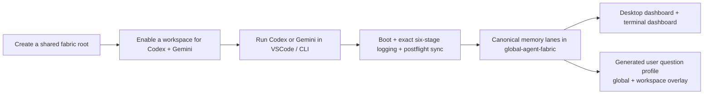
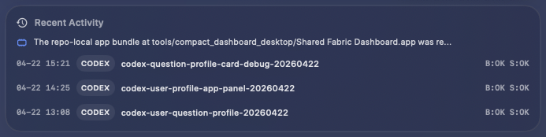

# Shared Fabric for Codex + Gemini

Shared Fabric is a setup-first shared memory and synchronization layer for running Codex and Gemini CLI against one canonical fabric root.

The desktop app in this repository is still called **Shared Fabric Dashboard**, but the public product story for `v3.1.0` now centers the real pairing: **Codex + Gemini**, not the earlier Antigravity experiments that this repo name grew out of.

[Download v3.1.0](https://github.com/Fly-Carrot/antigravity-codex-deployment/releases/tag/v3.1.0) · [Release Notes](docs/releases/v3.1.0.md) · [Desktop App Source](tools/compact_dashboard_desktop/)


## What Ships in v3.1.0

- one-click shared-fabric storage bootstrap for a new machine
- workspace-first VSCode enablement for Codex and Gemini
- exact six-stage task visibility in terminal and macOS surfaces
- rich project memory across `Decision`, `Handoff`, `Mem`, `Loop`, `Learn`, and `Receipt`
- a new `Question Profile` card that exposes the compiled global user profile and current workspace overlay
- setup assistant inside the desktop app so storage-root creation and workspace enablement can happen without leaving the UI

## Why This Exists

This repository is **not** your live memory store.

It is the portable deployment snapshot for standing up the same shared-fabric workflow on another machine without copying private local state. The canonical runtime state still lives in the `global-agent-fabric` root you choose during setup.

## How the Stack Works



## Setup

### 1. Create the shared storage root

You can do this from the desktop app:


Or directly from the CLI:

```bash
python3 install/bootstrap_shared_fabric.py
```

For non-interactive setup:

```bash
python3 install/bootstrap_shared_fabric.py \
  --non-interactive \
  --global-root /path/to/global-agent-fabric \
  --desktop-root /path/to/Desktop
```

This step creates the directory skeleton, renders local config, installs the portable snapshot, and runs the doctor chain.

### 2. Enable a workspace for Codex and Gemini

```bash
python3 install/bootstrap_vscode_workspace.py \
  --workspace /path/to/workspace \
  --global-root /path/to/global-agent-fabric \
  --runtimes both
```

This generates:

- project-root `AGENTS.md`
- `.vscode/tasks.json`
- Gemini compatibility settings for `AGENTS.md` / `GEMINI.md`
- the workspace profile stub at `.agents/sync/user-question-profile.md`

The generated VSCode task surface includes:

- `Shared Fabric: Boot Current Workspace`
- `Shared Fabric: Sync Current Workspace`
- `Shared Fabric: Postflight Sync`
- `Shared Fabric: Open Global Root`
- `Shared Fabric: Rebuild Workspace Entry`

## Recommended Startup Snippet

Drop a workspace-adjusted version of this into your runtime instructions:

```text
Use /path/to/global-agent-fabric as the canonical shared fabric.
Before substantial work, run the shared boot sequence for this workspace and report [BOOT_OK].
Load global shared context first, then runtime-specific context, then the current project overlay.
For complex tasks, emit exact six-stage phase events via log_task_phase.py so the dashboard can track progress.
Write back through postflight_sync.py and report [SYNC_OK].
Treat this workspace as project-scoped, not global.

Do not write directly to memory/*.ndjson or sync/*.ndjson; use canonical sync scripts only.
Prefer canonical rich-memory bundle generation over ad-hoc summary-only records.
Route stable reusable learnings to promoted learning, and route detailed process memory / trial-and-error to MemPalace.

Maintain a distilled user-question profile through canonical postflight sync.
For each substantial task, distill the user's recurring focus points, question patterns, response preferences, reasoning preferences, recurring themes, and frictions/anxieties into a structured user-question-profile payload.
Do not persist raw user prompts by default.
Treat the user-question profile as global-first, and let the current workspace contribute only a project-specific overlay.

Use available MCP tools and local skills when they materially improve accuracy, but keep shared-fabric synchronization on canonical scripts rather than ad-hoc file writes.
If the active postflight_sync.py does not support user-question-profile distillation, do not claim full sync; say explicitly that user-question-profile write-back is still missing.
A task is not fully synced unless postflight includes a user-question-profile distillation payload for substantial work.
```

## Desktop Dashboard Surfaces

### Session


The `Session` card shows the active runtime, current task id, workspace path, boot/sync/audit health, and currently enabled MCP count. It is the quickest way to tell whether the workspace is alive and whether the latest task has fully synced.

### Phase


The `Phase` card mirrors the exact six-stage flow:

`route -> plan -> review -> dispatch -> execute -> report`

When phase logs exist, the dashboard shows the exact live stage and note. If they do not, it falls back to heuristic receipts instead of inventing progress.

### Sync Delta


`Sync Delta` shows what the latest postflight actually wrote. It exposes per-target write counts, durable learned items, skipped items, and a clickable drill-down into the exact lane records behind the latest sync.

### Question Profile


`Question Profile` is new in `v3.1.0`.

It shows two distilled views:

- `Global`: the stable cross-project questioning profile
- `Workspace`: the current project's overlay on top of that global profile

This helps future agents preload not only task memory, but also the user's recurring concerns, preferred framing, and reasoning style.

### Project Memory


`Project Memory` is the cumulative browser over the six canonical boards. It is intentionally different from `Sync Delta`:

- `Sync Delta` = the latest task's audit
- `Project Memory` = the project's accumulated memory over time

### Recent Activity



`Recent Activity` is the lightweight timeline. It surfaces the latest handoff summary plus recent task ids with boot/sync state, so you can see what just happened without opening raw lane files.

## Shared Memory Model

The shared fabric keeps one canonical memory family and expands task outputs into six visible boards:

| Board | Purpose |
| --- | --- |
| `Decision` | Chosen approaches, architecture calls, user-approved directions |
| `Handoff` | Current state, completed work, and exact next actions |
| `Mem` | Trial-and-error, reasoning paths, and nuanced rationale |
| `Loop` | Blockers, unresolved risks, and remaining work |
| `Learn` | Stable reusable lessons and promoted learnings |
| `Receipt` | Sync audit records, counts, provenance, and cross-links |

`Question Profile` is additive. It is not a seventh lane. Instead, it is a compiled distilled layer built from substantial-task postflight snapshots.

## Repository Layout

```text
shared-fabric-repo/
  docs/
    assets/
    releases/
  fabric/
    scripts/
      sync/
  install/
  tests/
  tools/
    compact_dashboard/
    compact_dashboard_desktop/
```

## Notes

- The canonical shared state lives in your chosen `global-agent-fabric` root, not in this repository.
- VSCode integration is intentionally workspace-first rather than extension-first.
- The repository name remains historical for compatibility, but the public product story now targets Codex + Gemini directly.
- Historical bridge metadata is still read for compatibility, but it is treated as provenance rather than a primary control surface.
