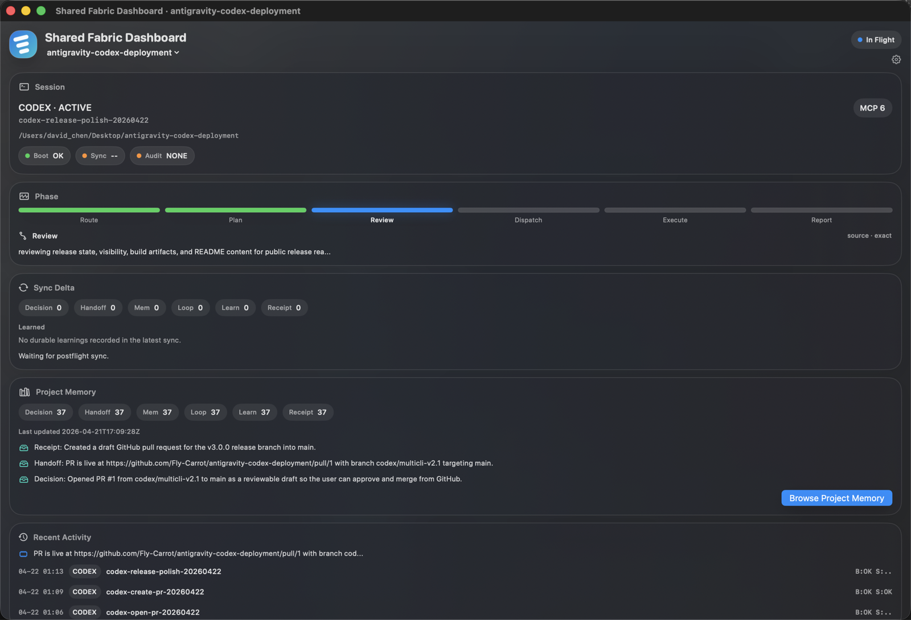
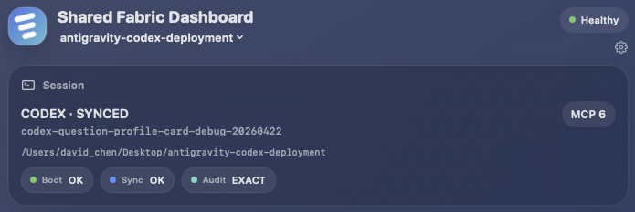
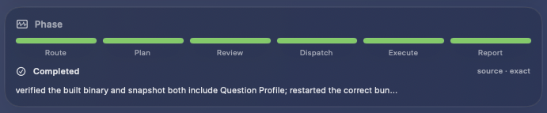
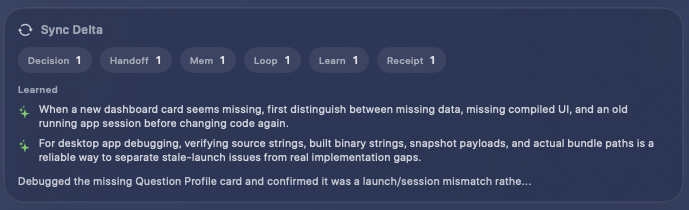
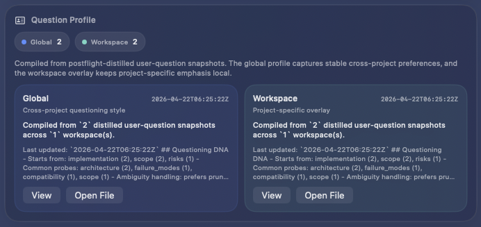
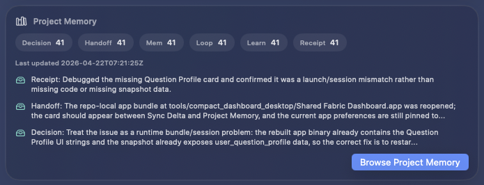
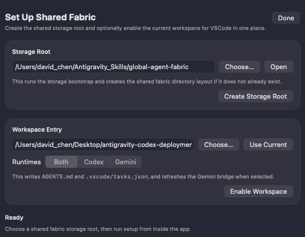

# Shared Fabric Dashboard

<p align="center">
  
</p>

<h3 align="center">Personal AI Memory Console for Codex and Gemini</h3>
<h3 align="center">面向 Codex 与 Gemini 的个人 AI 记忆控制台</h3>

<p align="center">
  Shared Fabric Dashboard gives CLI agents a durable memory system, exact task visibility, and a clean desktop observer.
  <br/>
  It works well with <strong>one runtime</strong>, and gets even better when Codex and Gemini share the same fabric.
</p>

<p align="center">
  Shared Fabric Dashboard 为 CLI agent 提供持久记忆、精确任务可视化，以及干净的桌面观察界面。
  <br/>
  它在<strong>单一 runtime</strong>下就已经很好用，而当 Codex 与 Gemini 共享同一套 fabric 时会更强。
</p>

<p align="center">
  
  
  
  
  
  
</p>

<p align="center">
  <a href="https://github.com/Fly-Carrot/shared-fabric-codex-gemini/releases/tag/v3.1.1">Download v3.1.1 / 下载 v3.1.1</a>
  ·
  <a href="docs/releases/v3.1.1.md">Release Notes / 发布说明</a>
  ·
  <a href="tools/compact_dashboard_desktop/">Desktop App Source / 桌面 App 源码</a>
</p>

<p align="center">
  <strong>Language / 语言：</strong>
  <a href="#english">English</a>
  ·
  <a href="#中文">中文</a>
</p>



---

<a id="english"></a>

## English

### Why This Exists

Most agent setups still lose context between sessions, hide what actually synced, and make memory quality hard to inspect.

Shared Fabric Dashboard solves that with one canonical shared fabric root:

- use `Codex` alone and get durable project memory, question-profile distillation, and phase visibility
- use `Gemini CLI` alone and get the same boot, sync, memory, and dashboard surfaces
- use both together and let them read and write into the same structured memory system

This repository is the portable deployment snapshot for that workflow. Your live memory does **not** live here. It lives in the `global-agent-fabric` root you choose during setup.

### What You Actually Get

- **Shared memory lanes**: `Decision`, `Handoff`, `Mem`, `Loop`, `Learn`, and `Receipt`
- **Question Profile**: a distilled global user profile plus workspace overlay
- **Six-stage task tracking**: `route -> plan -> review -> dispatch -> execute -> report`
- **Desktop observer**: session health, phase, sync delta, project memory, recent activity, and setup assistant
- **Obsidian export**: manual export of readable Codex and Gemini chat history into your vault

### Feature Tour

#### 1. Session Health



See the active runtime, task id, workspace path, boot status, sync status, and audit health in one place.

#### 2. Exact Phase Tracking



Track real six-stage progress from canonical phase logs instead of guessing from chat output.

#### 3. Latest Sync Audit



Inspect what the latest postflight actually wrote, lane by lane, without opening raw ndjson files.

#### 4. User Question Profile



Carry forward how the user tends to ask, what they care about, and how they prefer answers to be framed.

#### 5. Cumulative Project Memory



Browse the growing project memory timeline rather than just the newest sync receipt.

#### 6. Setup Assistant



Stand up a clean shared fabric root and enable a workspace without leaving the app.

### Setup

#### 1. Create the shared storage root

From the desktop app, open the setup assistant.

Or use the CLI:

```bash
python3 install/bootstrap_shared_fabric.py
```

For non-interactive setup:

```bash
python3 install/bootstrap_shared_fabric.py \
  --non-interactive \
  --global-root /path/to/global-agent-fabric \
  --desktop-root /path/to/Desktop
```

This creates the shared directory skeleton, renders local config, installs the portable snapshot, and runs the doctor chain.

#### 2. Enable a workspace

```bash
python3 install/bootstrap_vscode_workspace.py \
  --workspace /path/to/workspace \
  --global-root /path/to/global-agent-fabric \
  --runtimes both
```

This generates:

- project-root `AGENTS.md`
- `.vscode/tasks.json`
- Gemini compatibility settings for `AGENTS.md` and `GEMINI.md`
- `.agents/sync/user-question-profile.md`

The generated VSCode task surface includes:

- `Shared Fabric: Boot Current Workspace`
- `Shared Fabric: Sync Current Workspace`
- `Shared Fabric: Postflight Sync`
- `Shared Fabric: Open Global Root`
- `Shared Fabric: Rebuild Workspace Entry`

### Recommended Startup Snippet

Use a workspace-adjusted version of this in your runtime instructions:

```text
Use /path/to/global-agent-fabric as the canonical shared fabric.
Before substantial work, run the shared boot sequence for this workspace and report [BOOT_OK].
Load global shared context first, then runtime-specific context, then the current project overlay.
For complex tasks, emit exact six-stage phase events via log_task_phase.py so the dashboard can track progress.
Write back through postflight_sync.py and report [SYNC_OK].
Treat this workspace as project-scoped, not global.

Do not write directly to memory/*.ndjson or sync/*.ndjson; use canonical sync scripts only.
Prefer canonical rich-memory bundle generation over ad-hoc summary-only records.
Route stable reusable learnings to promoted learning, and route detailed process memory / trial-and-error to MemPalace.

Maintain a distilled user-question profile through canonical postflight sync.
For each substantial task, distill the user's recurring focus points, question patterns, response preferences, reasoning preferences, recurring themes, and frictions/anxieties into a structured user-question-profile payload.
Do not persist raw user prompts by default.
Treat the user-question profile as global-first, and let the current workspace contribute only a project-specific overlay.

Use available MCP tools and local skills when they materially improve accuracy, but keep shared-fabric synchronization on canonical scripts rather than ad-hoc file writes.
If the active postflight_sync.py does not support user-question-profile distillation, do not claim full sync; say explicitly that user-question-profile write-back is still missing.
A task is not fully synced unless postflight includes a user-question-profile distillation payload for substantial work.
```

### Shared Memory Model

| Board | Purpose |
| --- | --- |
| `Decision` | Chosen approaches, architecture calls, and user-approved directions |
| `Handoff` | Current state, completed work, and exact next actions |
| `Mem` | Trial-and-error, reasoning paths, and nuanced rationale |
| `Loop` | Blockers, unresolved risks, and remaining work |
| `Learn` | Stable reusable lessons and promoted learnings |
| `Receipt` | Sync audit records, counts, provenance, and cross-links |

`Question Profile` is additive. It is not a seventh lane. It is a compiled distilled layer generated from substantial-task postflight snapshots.

### Repository Layout

```text
shared-fabric-repo/
  docs/
    assets/
    releases/
  fabric/
    scripts/
      sync/
  install/
  tests/
  tools/
    compact_dashboard/
    compact_dashboard_desktop/
```

### Notes

- The app bundle is still named `Shared Fabric Dashboard`.
- The canonical shared state lives in your chosen `global-agent-fabric` root, not in this repository.
- VSCode integration is intentionally workspace-first rather than extension-first.
- Historical bridge metadata is still readable for compatibility, but it is treated as provenance rather than a primary control surface.

---

<a id="中文"></a>

## 中文

### 为什么做这个

大多数 agent 工作流仍然会在会话之间丢失上下文，难以确认到底同步了什么，也很难检查记忆质量。

Shared Fabric Dashboard 用一个 canonical shared fabric root 来解决这件事：

- 只用 `Codex`，也能获得持久项目记忆、提问画像蒸馏与 phase 可视化
- 只用 `Gemini CLI`，也能获得同样的 boot、sync、memory 与 dashboard 能力
- 两者一起使用时，则可以读写同一套结构化共享记忆

这个仓库是这套工作流的可移植部署快照。你的实时记忆**不**存放在这里，而是存放在你 setup 时选择的 `global-agent-fabric` 根目录中。

### 你实际会得到什么

- **共享记忆板块**：`Decision`、`Handoff`、`Mem`、`Loop`、`Learn`、`Receipt`
- **Question Profile**：全局用户画像蒸馏，以及当前 workspace 的覆盖层
- **六阶段任务追踪**：`route -> plan -> review -> dispatch -> execute -> report`
- **桌面观察台**：session health、phase、sync delta、project memory、recent activity 与 setup assistant
- **Obsidian 导出**：可将可读的 Codex 与 Gemini 聊天记录手动导入你的 vault

### 功能导览

#### 1. 会话健康状态


在一张卡片里查看当前 runtime、task id、workspace 路径、boot 状态、sync 状态和 audit 健康度。

#### 2. 精确阶段追踪


直接依据 canonical phase logs 追踪真实的六阶段进度，而不是靠聊天内容去猜。

#### 3. 最新同步审计


无需打开原始 ndjson 文件，就能逐板块查看最新一次 postflight 实际写入了什么。

#### 4. 用户提问画像


把用户通常如何提问、关心什么、偏好怎样的回答结构持续蒸馏并带入后续任务。

#### 5. 累积项目记忆


浏览不断增长的项目记忆时间线，而不是只看最新一条 sync receipt。

#### 6. 初始化向导


不用离开 app，就能初始化一个干净的 shared fabric root，并为 workspace 启用这套规则。

### 安装与接入

#### 1. 创建共享存储根目录

可以直接从桌面 app 打开 setup assistant。

或者使用 CLI：

```bash
python3 install/bootstrap_shared_fabric.py
```

如果你想无交互安装：

```bash
python3 install/bootstrap_shared_fabric.py \
  --non-interactive \
  --global-root /path/to/global-agent-fabric \
  --desktop-root /path/to/Desktop
```

这一步会创建共享目录骨架、渲染本地配置、安装可移植快照，并跑一遍 doctor 校验链。

#### 2. 为一个 workspace 启用这套规则

```bash
python3 install/bootstrap_vscode_workspace.py \
  --workspace /path/to/workspace \
  --global-root /path/to/global-agent-fabric \
  --runtimes both
```

这一步会生成：

- 项目根目录的 `AGENTS.md`
- `.vscode/tasks.json`
- 兼容 `AGENTS.md` 与 `GEMINI.md` 的 Gemini 设置
- `.agents/sync/user-question-profile.md`

自动注入的 VSCode task 包括：

- `Shared Fabric: Boot Current Workspace`
- `Shared Fabric: Sync Current Workspace`
- `Shared Fabric: Postflight Sync`
- `Shared Fabric: Open Global Root`
- `Shared Fabric: Rebuild Workspace Entry`

### 推荐启动 Snippet

把下面这段按你的 workspace 路径调整后，放进 runtime 指令中即可：

```text
Use /path/to/global-agent-fabric as the canonical shared fabric.
Before substantial work, run the shared boot sequence for this workspace and report [BOOT_OK].
Load global shared context first, then runtime-specific context, then the current project overlay.
For complex tasks, emit exact six-stage phase events via log_task_phase.py so the dashboard can track progress.
Write back through postflight_sync.py and report [SYNC_OK].
Treat this workspace as project-scoped, not global.

Do not write directly to memory/*.ndjson or sync/*.ndjson; use canonical sync scripts only.
Prefer canonical rich-memory bundle generation over ad-hoc summary-only records.
Route stable reusable learnings to promoted learning, and route detailed process memory / trial-and-error to MemPalace.

Maintain a distilled user-question profile through canonical postflight sync.
For each substantial task, distill the user's recurring focus points, question patterns, response preferences, reasoning preferences, recurring themes, and frictions/anxieties into a structured user-question-profile payload.
Do not persist raw user prompts by default.
Treat the user-question profile as global-first, and let the current workspace contribute only a project-specific overlay.

Use available MCP tools and local skills when they materially improve accuracy, but keep shared-fabric synchronization on canonical scripts rather than ad-hoc file writes.
If the active postflight_sync.py does not support user-question-profile distillation, do not claim full sync; say explicitly that user-question-profile write-back is still missing.
A task is not fully synced unless postflight includes a user-question-profile distillation payload for substantial work.
```

### 共享记忆模型

| 板块 | 作用 |
| --- | --- |
| `Decision` | 记录选定方案、架构决策与用户确认的方向 |
| `Handoff` | 记录当前状态、已完成内容与明确的下一步动作 |
| `Mem` | 记录试错过程、思考路径与细腻的理由 |
| `Loop` | 记录阻塞项、未决风险与剩余工作 |
| `Learn` | 记录稳定可复用的经验与 promoted learnings |
| `Receipt` | 记录同步审计、计数、来源与交叉引用 |

`Question Profile` 是附加层，不是第七条 lane。它是由 substantial task 的 postflight 快照编译出来的蒸馏层。

### 仓库结构

```text
shared-fabric-repo/
  docs/
    assets/
    releases/
  fabric/
    scripts/
      sync/
  install/
  tests/
  tools/
    compact_dashboard/
    compact_dashboard_desktop/
```

### 备注

- app bundle 名称目前仍然是 `Shared Fabric Dashboard`
- canonical shared state 存在你选择的 `global-agent-fabric` 根目录里，而不是这个仓库里
- VSCode 接入是刻意采用 workspace-first，而不是 extension-first
- 历史 bridge metadata 仍然可读以保持兼容，但现在更被视作 provenance，而不是主控制面
